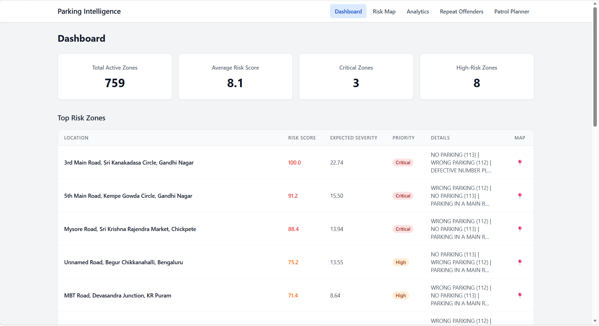
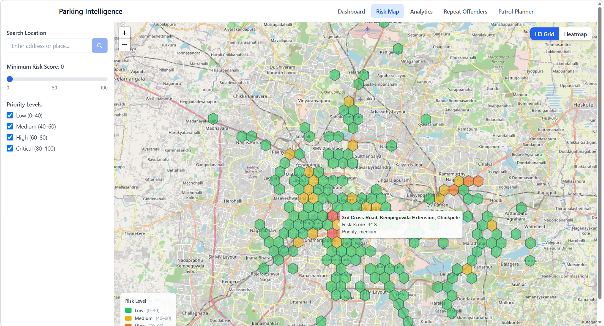
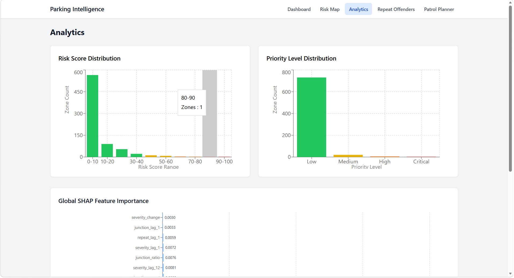
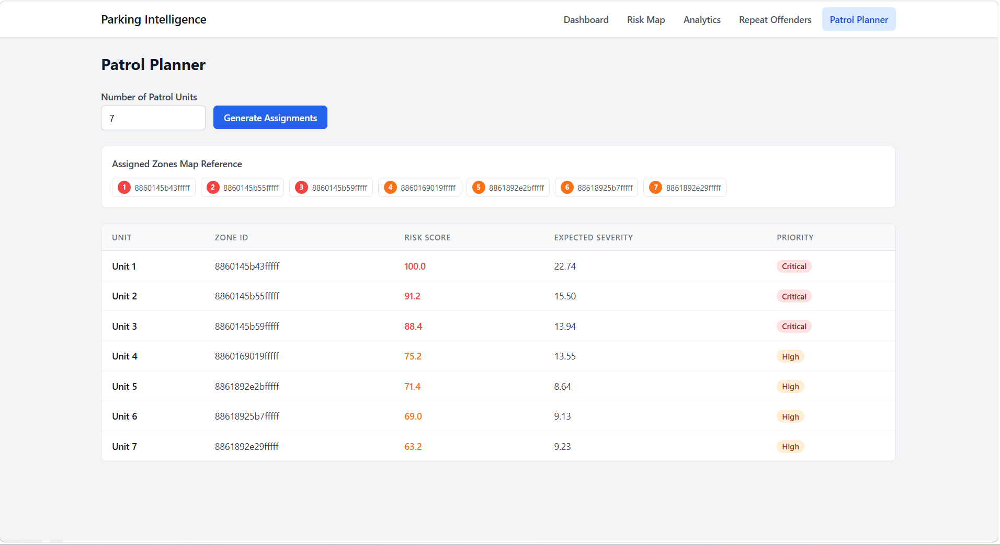
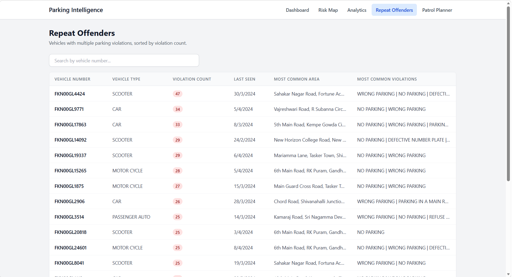

# AI-Driven Parking Intelligence System

## Project Overview

A full-stack analytics platform that combines machine learning predictions with geospatial visualization to help parking enforcement teams in Bengaluru, India identify high-risk zones, plan optimal patrol routes, and understand violation patterns. The system uses pre-computed ML predictions (XGBRegressor + activity classification) served through CSV files, an Express API backend, and a React frontend with interactive Leaflet maps.

## Problem Statement

Urban parking enforcement in Bengaluru faces challenges including:

- Difficulty identifying which zones have the highest violation risk
- Inefficient patrol planning without data-driven zone prioritization
- Lack of visibility into which vehicle types and areas are repeat offenders
- No unified view of risk factors driving parking violations

This system addresses these challenges by providing AI-powered risk predictions, interactive geospatial visualization, and intelligent patrol planning.

## Features

### Dashboard

- 4 KPI cards (Total Active Zones, Average Risk Score, Critical Zones, High-Risk Zones)
- Top Enforcement Zones table with Location, Risk Score, Expected Severity, Priority, Violation Details, Map button
- Paginated (20/page), sorted by risk descending
- Click to navigate to Risk Map

### Risk Map

- Interactive Leaflet map centered on Bengaluru (12.9716, 77.5946)
- H3 hexagonal grid overlay colored by priority level (green/yellow/orange/red)
- Continuous heatmap visualization (toggle between H3 Grid and Heatmap)
- Auto-fit bounds to loaded zone data
- Sidebar with risk threshold slider and priority level checkboxes
- Location search with geocoding
- Zone details drawer showing: location, violations, risk metrics, contributing features, recommended actions
- Risk legend always visible

### Analytics

- Risk Distribution Histogram (0-100 bins)
- Priority Distribution bar chart (Low/Medium/High/Critical counts)
- SHAP Global Feature Importance chart (top 20 features, horizontal bars)

### Patrol Planner

- Input number of patrol units (1-50)
- Assigns top N highest-risk zones (risk >= 40) to units
- Ranked assignment: Unit 1 gets highest risk
- Shortfall notification when fewer qualifying zones than units
- Map markers for assigned zones

### Repeat Offenders

- Searchable table of vehicles with multiple violations
- Columns: Vehicle Number, Vehicle Type, Violation Count, Last Seen, Most Common Area, Most Common Violations
- Search by vehicle number
- Paginated (20/page), sorted by violation count descending

### Cross-Cutting

- Session-level zone caching (TanStack Query)
- Retry with exponential backoff on 5xx errors
- 10-second timeout on API calls
- Loading indicators and error states throughout
- Responsive navigation bar

## System Architecture

```
┌─────────────────────────────────────────────────────────────────────┐
│                        Frontend                                     │
│         React 18 + Tailwind CSS + Leaflet + Recharts                │
│                                                                     │
│  ┌───────────┐ ┌──────────┐ ┌───────────┐ ┌────────┐ ┌──────────┐   │
│  │ Dashboard │ │ Risk Map │ │ Analytics │ │ Patrol │ │ Repeat   │   │
│  │           │ │ (Leaflet)│ │ (Recharts)│ │Planner │ │ Offenders│   │
│  └─────┬─────┘ └────┬─────┘ └─────┬─────┘ └───┬────┘ └────┬─────┘   │
│        │             │             │            │           │       │
│        └─────────────┴─────────────┴────────────┴───────────┘       │
│                              │                                      │
│                    TanStack Query + Axios                           │
└──────────────────────────────┬──────────────────────────────────────┘
                               │ HTTP (REST JSON)
┌──────────────────────────────┴──────────────────────────────────────┐
│                        Backend (Express API)                        │
│                                                                     │
│  ┌────────────────┐  ┌──────────────────┐  ┌────────────────────┐   │
│  │ Route Handlers │  │  Business Logic  │  │  In-Memory Cache   │   │
│  │(REST endpoints)│  │  (Services)      │  │  (Parsed CSV data) │   │
│  └────────┬───────┘  └────────┬─────────┘  └─────────┬──────────┘   │
│           └───────────────────┴───────────────────────┘             │
└──────────────────────────────┬──────────────────────────────────────┘
                               │ File I/O (startup only)
┌──────────────────────────────┴──────────────────────────────────────┐
│                        Data Layer (CSV Files)                       │
│                                                                     │
│  latest_risk_predictions.csv    (759 zone predictions)              │
│  top_enforcement_zones.csv      (Pre-ranked top zones)              │
│  shap_feature_importance.csv    (Global SHAP values)                │
│  h3_zone_metadata.csv           (Zone location names & violations)  │
│  repeat_offenders.csv           (Repeat offender vehicles)          │
└──────────────────────────────┬──────────────────────────────────────┘
                               │ Generated offline (batch)
┌──────────────────────────────┴──────────────────────────────────────┐
│                   ML Service (Offline Only)                         │
│                                                                     │
│  XGBRegressor (severity prediction)                                 │
│  Activity Probability Classifier                                    │
│  SHAP Explainer (feature importance)                                │
│  H3 Spatial Indexing                                                │
│                                                                     │
│  ⚠️  NOT used at runtime in V1 — generates CSVs offline only       │
└─────────────────────────────────────────────────────────────────────┘
```

V1 is entirely CSV-based with no runtime ML inference. The ML service runs offline to generate prediction CSV files which are then served by the Express API. No database, no live model calls, and no FastAPI endpoints are used at runtime.

## Technology Stack

### Frontend

| Technology | Purpose |
|---|---|
| React 18 + TypeScript | UI framework |
| Tailwind CSS | Utility-first styling |
| Leaflet + react-leaflet | Interactive maps |
| leaflet.heat | Heatmap visualization |
| h3-js | H3 hexagonal grid rendering |
| Recharts | Analytics charts |
| TanStack React Query | Server state management & caching |
| Axios | HTTP client with retry logic |
| React Router v6 | Client-side routing |
| Vite | Build tool & dev server |
| Vitest + Testing Library | Unit & component testing |

### Backend

| Technology | Purpose |
|---|---|
| Node.js + Express | REST API server |
| TypeScript | Type safety |
| PapaParse | CSV parsing & validation |
| CORS middleware | Cross-origin requests |
| Vitest + Supertest | API testing |

### ML/Data (Offline)

| Technology | Purpose |
|---|---|
| XGBRegressor | Severity prediction |
| Activity Probability Classifier | Activity classification |
| SHAP | Feature importance explanation |
| H3 | Hexagonal spatial indexing |

**Risk Formula:**
```
risk_score_100 = activity_probability × log(1 + expected_severity)
```
Normalized to a 0–100 scale.

## Project Structure

```
├── backend/
│   ├── data/                          # CSV data files
│   │   ├── latest_risk_predictions.csv   # 759 zone predictions
│   │   ├── top_enforcement_zones.csv     # Pre-ranked top zones
│   │   ├── shap_feature_importance.csv   # Global SHAP values
│   │   ├── h3_zone_metadata.csv          # Zone location names & violations
│   │   └── repeat_offenders.csv          # Repeat offender vehicles
│   ├── src/
│   │   ├── index.ts                   # Express app entry point
│   │   ├── routes/                    # API route handlers
│   │   ├── services/                  # Business logic
│   │   ├── middleware/                # Error handling, validation
│   │   ├── types/                     # TypeScript interfaces
│   │   └── utils/                     # Formatters
│   ├── package.json
│   ├── tsconfig.json
│   └── vitest.config.ts
├── frontend/
│   ├── src/
│   │   ├── App.tsx                    # Root component with routing
│   │   ├── pages/                     # Page components
│   │   ├── components/                # UI components
│   │   │   ├── dashboard/            # KPI cards, zones table
│   │   │   ├── map/                  # Map, H3Layer, Heatmap, etc.
│   │   │   ├── analytics/           # Chart components
│   │   │   ├── patrol/              # Patrol planner components
│   │   │   ├── shap/                # SHAP panel
│   │   │   └── shared/              # Navigation, Loading, Error, Pagination
│   │   ├── hooks/                    # Custom hooks
│   │   ├── services/                 # API client
│   │   ├── types/                    # TypeScript interfaces
│   │   └── utils/                    # Risk colors, formatters, H3 utils
│   ├── package.json
│   ├── vite.config.ts
│   └── index.html
└── ml-service/
    └── models/                        # Future ML artifacts (not used in V1)
```

## Installation & Setup

### Prerequisites

- Node.js 18+
- npm 9+

### Backend Setup

```bash
cd backend
npm install
```

### Frontend Setup

```bash
cd frontend
npm install
```

## Running the Application

### Start Backend (Port 3001)

```bash
cd backend
npm run dev
```

Or production build:

```bash
npm run build
npm start
```

### Start Frontend (Port 5173)

```bash
cd frontend
npm run dev
```

### Run Tests

```bash
# Backend tests
cd backend
npm test

# Frontend tests
cd frontend
npm test
```

## Environment Variables

| Variable | Default | Description |
|----------|---------|-------------|
| `PORT` | 3001 | Backend server port |
| `VITE_API_BASE_URL` | http://localhost:3001 | Frontend API base URL |

## API Endpoints

| Method | Endpoint | Description |
|--------|----------|-------------|
| GET | `/api/health` | Health check |
| GET | `/api/dashboard` | KPI summary metrics |
| GET | `/api/zones` | All zones (supports `?min_risk` and `?level` filters) |
| GET | `/api/zones/:id` | Single zone full detail |
| GET | `/api/patrol/assignments?units=N` | Patrol unit assignments (N: 1-50) |
| GET | `/api/analytics` | Histogram + priority distribution + SHAP |
| GET | `/api/shap` | Global SHAP feature importance (top 20) |
| GET | `/api/repeat-offenders` | Repeat offenders (supports `?search`, `?page`, `?pageSize`, `?sortOrder`) |


## Data Model

### Risk Score Calculation

```
risk_score_100 = activity_probability × log(1 + expected_severity)
```

Normalized to 0–100 scale.

### Priority Levels

| Level | Risk Score Range | Color |
|-------|-----------------|-------|
| Low | 0 – 39 | Green |
| Medium | 40 – 59 | Yellow |
| High | 60 – 79 | Orange |
| Critical | 80 – 100 | Red |

### ML Features (21 total)

| Feature | Description |
|---------|-------------|
| `violations` | Historical violation count |
| `severity` | Raw severity metric |
| `avg_severity` | Average severity per violation |
| `unique_vehicles` | Count of unique vehicles observed |
| `junction_count` | Number of junctions in zone |
| `avg_repeat_offender` | Average repeat offender rate |
| `hour` | Hour of day (0–23) |
| `day_of_week` | Day of week (0–6) |
| `month` | Month (1–12) |
| `is_weekend` | Weekend indicator (0/1) |
| `cell_density` | Spatial density of cells |
| `severity_lag_1` | Severity lag 1 period |
| `severity_lag_12` | Severity lag 12 periods |
| `severity_lag_84` | Severity lag 84 periods |
| `junction_lag_1` | Junction count lag 1 period |
| `repeat_lag_1` | Repeat offender lag 1 period |
| `severity_roll_3` | 3-period rolling severity |
| `severity_roll_12` | 12-period rolling severity |
| `severity_change` | Severity change metric |
| `activity_rate_12` | 12-period activity rate |
| `junction_ratio` | Junction ratio metric |

## User Workflow

1. **Dashboard** — Quick overview of enforcement landscape with KPIs and top zones
2. **Risk Map** — Drill into geographic patterns, filter by risk level, click zones for details
3. **Analytics** — Understand risk distribution and model feature importance
4. **Patrol Planner** — Generate optimized patrol assignments based on available units
5. **Repeat Offenders** — Identify and search for vehicles with multiple violations

## Screenshots

### Dashboard

*KPI cards and Top Enforcement Zones table with Bengaluru location names*

### Risk Map - H3 Grid

*H3 hexagonal grid colored by priority level*

### Analytics

*Risk distribution histogram, priority distribution, and SHAP feature importance*

### Patrol Planner

*Patrol unit assignment interface*

### Repeat Offenders

*Searchable repeat offender table*

> **Note:** Replace placeholder images above with actual screenshots. Create a `docs/screenshots/` directory and add PNG files with the names shown.

## License

This project is licensed under the MIT License.

